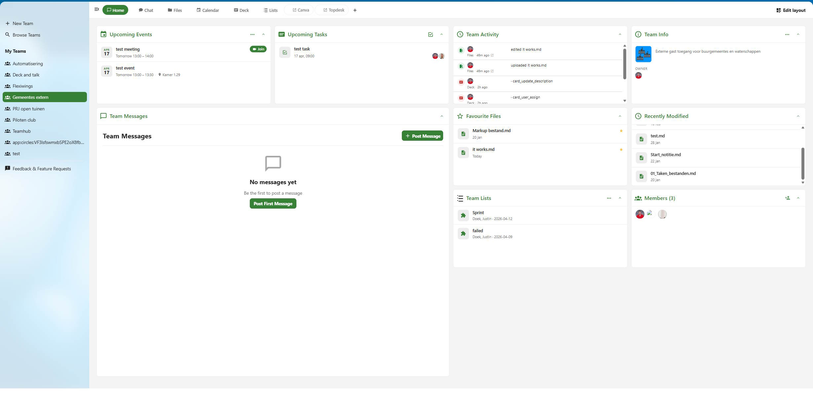

# TeamHub for Nextcloud

TeamHub gives every Nextcloud Team a proper home. It wraps the existing Teams (Circles) infrastructure and provisions a shared workspace including: messages, Talk chat, Files folder, Calendar, Deck board and Intravox pages. All accessible from one team view.



## Features

### Team workspace
Each team gets a tab bar linking directly to its shared apps:
- **Home** — team messages, comments, polls and questions
- **Chat** — opens the team's shared Talk conversation
- **Files** — opens the team's shared Files folder
- **Calendar** — opens the team's shared calendar
- **Deck** — opens the team's shared Deck board
- Custom links can be added to the tab bar by team admins

### Sidebar widgets
Always visible next to the message stream:
- **Team info** — description, team type labels (open/invite-only/public etc.), owner, member avatar stack, admin actions
- **Upcoming events** — next events pulled from the team calendar
- **Open tasks** — cards from the team Deck board
- **Pages** — pages from the team's IntraVox space (if installed)
- **Activity snapshot** — 5 most recent events across all team resources, with a "More" link

### Activity feed
A dedicated full-canvas view showing everything that happened in the team over the past 30 days, grouped by day — file uploads and edits, calendar events, Deck card changes, member joins and leaves.

### Team messages
Post announcements, questions and polls to your team. Members are notified. Messages support inline editing and threaded comments.

### Team management
- Create teams with name, description and visibility settings
- Invite members by local user, group, email address or federated account (configurable per instance by admins)
- Remove members, approve or reject join requests
- Configure team options (open join, invite-only, approval required, member invitations, visible, password-protected)
- Transfer team ownership to another member (owner-only)
- Browse and request access to teams you're not a member of

### Admin settings
- Set a custom wizard description shown during team creation
- Control which invite types (user / group / email / federated) are available to team admins
- Set the minimum member level required to pin messages
- Manage all teams: set owner, delete teams, repair membership cache

## Requirements

- Nextcloud 32 or later
- PHP 8.1 – 8.4
- Nextcloud Teams (Circles) app — included with Nextcloud, must be enabled
- PostgreSQL or MySQL/MariaDB

Optional integrations (TeamHub auto-detects what is installed):
- Nextcloud Talk
- Nextcloud Calendar
- Nextcloud Deck
- IntraVox (Pages)

## Installation

### From a release zip

1. Download the latest release zip from the [Releases](../../releases) page
2. Extract into your Nextcloud apps directory:
   ```bash
   cd /path/to/nextcloud/apps
   unzip teamhub-x.y.z.zip
   ```
3. Enable the app:
   ```bash
   sudo -u www-data php occ app:enable teamhub
   ```

The release zip contains pre-compiled JavaScript. You do not need npm.

## License

[AGPL-3.0](LICENSE)
