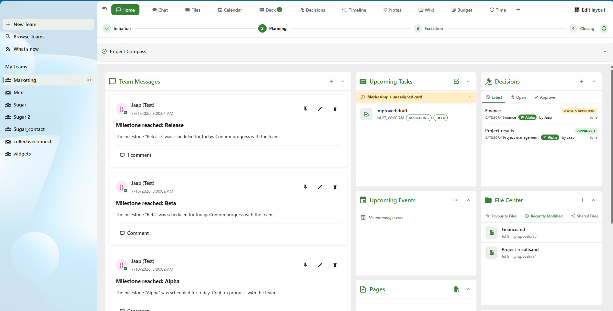

<p align="center">
  
</p>

<h1 align="center">TeamHub</h1>

<p align="center">
  A team collaboration hub for Nextcloud — a shared home for every Nextcloud Team (Circle), with messaging, widgets, an activity feed, and an open integration layer for other apps.
</p>

<p align="center">
  
  
  
</p>

<p align="center">
  
</p>

---

## What is TeamHub?

Nextcloud's built-in Dashboard is personal — it's about *you*. TeamHub is the team-scoped equivalent: every Nextcloud Team (Circle) gets its own home with a message stream, a widget-driven overview, and quick access to the apps that team actually uses — Talk, Files, Calendar, Deck — all in one place.

It started as a visual mock-up to discuss what team-based working could look like inside Nextcloud, and grew into a full workspace layer built on top of Nextcloud Teams. TeamHub works entirely within your own Nextcloud instance — no external services, no data leaving your server.

## Features

- **My Work** — one personal queue of what every team needs from you, across sources. Deck cards assigned to you, file approvals waiting on you, and decisions awaiting your approval land in the same list, grouped into Action required, Today, Upcoming, Waiting for others and Completed. Every row says why it is there, which team it belongs to, and who is waiting on whom — and you can approve, complete, snooze or open it without leaving TeamHub. New sources plug in behind one provider contract.
- **What's new** — one feed of everything happening across the teams you're in, plus public posts from teams you're not. Comments and Talk replies show on each item and you can answer, or vote in a Talk poll, without leaving the page. Filter by source, period, team, message type, or just what mentions you — and save that as your default.
- **Message stream** — post announcements, questions, and polls to the team. Pin important messages; reply in threads.
- **Activity feed** — one view of recent file, calendar, task, and member changes across everything the team has access to.
- **App tabs** — quick links to the team's shared Talk chat, Files folder, Calendar, and Deck board, opened inline.
- **Collaboration-first file opening** — open a file from TeamHub and the team's conversation about it opens with it, already joined. No hunting through Details → Chat → Join conversation first.
- **Timeline** — a visual, zoomable timeline aggregating Deck cards, Calendar events, Decisions, and Messages on one canvas, with admin-defined milestones and connector lines showing how items relate to each other.
- **Decisions** — propose, discuss, and formally approve team decisions, with categories, approvers, linked tasks, and a full audit trail.
- **Sidebar widgets** — upcoming calendar events, open Deck tasks, pages, presence/schedule, and an activity snapshot. Layout is per-user and drag-to-rearrange.
- **Team management** — invite by user, group, email, or federated account; manage roles and pending requests.
- **Open integration layer** — other Nextcloud apps can register their own sidebar widgets or sandboxed iframe tabs into a team's home. See [`developers.md`](developers.md).
- **Admin controls** — org-wide rollout settings, creation permissions, optional modules (Presence, IntraVox), audit and archive tooling.

## Requirements

- Nextcloud **32 – 34**
- PHP **8.1 – 8.4**
- MySQL/MariaDB or PostgreSQL
- The **Teams (Circles)** app, enabled

## Installation

Grab the latest release zip from the [Releases](../../releases) page, extract it into your Nextcloud `apps/` directory, and enable it:

```bash
unzip teamhub-x.y.z.zip -d /path/to/nextcloud/apps/
chown -R www-data:www-data /path/to/nextcloud/apps/teamhub
sudo -u www-data php occ app:enable teamhub
```

Database tables are created automatically on first enable. For building from source, admin settings, optional integrations, and background jobs, see **[INSTALL.md](INSTALL.md)**.

## Documentation

| Doc | What's in it |
|---|---|
| [INSTALL.md](INSTALL.md) | Installation, upgrading, admin settings, background jobs |
| [developers.md](developers.md) | Building widgets and tab integrations that plug into a team's home |
| [DESIGN.md](DESIGN.md) | Architecture decisions and the reasoning behind them |
| [ROADMAP.md](ROADMAP.md) | Forward-looking feature proposals |
| [CHANGELOG.md](CHANGELOG.md) | What shipped, by version |

## Building an integration

Other Nextcloud apps can add a sidebar widget or a tab-bar menu item to every team's home — resolved and called in-process via Nextcloud's DI container, no HTTP round-trip required:

```php
$teamHub->registerIntegration(
    appId:           'myapp',
    integrationType: 'widget',
    title:           'My Widget',
    description:     'Shows recent items from My App',
    icon:            'ChartBar',
    phpClass:        \OCA\MyApp\Integration\TeamHubWidget::class,
    calledInProcess: true,
);
```

Full guide, including the menu-item (iframe tab) integration type: **[developers.md](developers.md)**.

## Contributing

Issues and feature ideas are welcome on the [issue tracker](https://github.com/JustinDoek/nextcloud-teamhub/issues). Check [ROADMAP.md](ROADMAP.md) for what's already being considered.

## License

TeamHub is licensed under the [GNU Affero General Public License v3.0](LICENSE).
