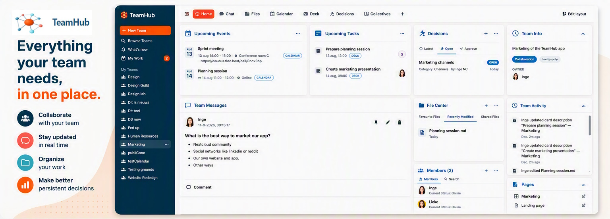

<p align="center">
  
</p>

<h1 align="center">TeamHub</h1>

<p align="center">
  A self-hosted team workspace for Nextcloud, and an open-source alternative to Microsoft Teams. Every Nextcloud Team gets one page to work on: messages, decisions, presence, projects and internal services.
</p>

<p align="center">
  
  
  
</p>

<p align="center">
  
</p>

---

## What is TeamHub?

TeamHub is a self-hosted team workspace for Nextcloud, an open-source alternative to Microsoft Teams that runs inside the Nextcloud you already have. A Nextcloud Team on its own is a membership list: a group you can share a folder or a calendar with. TeamHub turns that list into somewhere to work. Every team gets one page carrying a message stream, decisions, presence, an activity timeline, projects and internal services, beside the Talk conversation, team space, Calendar, Collective and Deck board that team already uses.

Nothing is copied and nothing has to be migrated. Deck stays the source of truth for cards, Talk for conversations, Files for documents. TeamHub reads across them and writes your actions back to them. It works entirely within your own Nextcloud instance: no external services, no hosted version, no data leaving your server.

Nextcloud's built-in Dashboard is personal. It's about *you*. TeamHub is the team-scoped equivalent. It started as a visual mock-up to discuss what team-based working could look like inside Nextcloud, and grew into a full workspace layer built on top of Nextcloud Teams.

## TeamHub and Microsoft Teams

Organisations replacing Microsoft 365 with Nextcloud find that mail, files, documents, chat and boards are all covered. The row Nextcloud does not cover on its own is Teams itself: the place a team works. That is the row TeamHub fills, without replacing anything already running.

| | Microsoft Teams | TeamHub for Nextcloud |
|---|---|---|
| Hosting | Microsoft's cloud | Your own server, self-hosted only |
| Licence | Proprietary, per user per month | AGPL-3.0. Free to develop with, licensed by seat count to run in production |
| Data residency | Microsoft's regions and sub-processors | Your instance, no sub-processor to add to your register |
| Chat | Built in | Nextcloud Talk, which you already run |
| Files | SharePoint | Nextcloud Files and team spaces |
| Boards | Planner | Nextcloud Deck, which stays the source of truth for cards |
| Decisions | Chat threads and meeting notes | A decision log with categories, approvers, the reasoning given, and an append-only trail |
| Presence | A status dot, about this second | A working location per half day, for the week ahead, synced to each member's calendar |
| Audit | Purview, depending on the plan | Append-only per-team audit log and an ISO/IEC 27001:2022 control report |

Moving an existing estate across is covered by bulk team import: one CSV, one row per team, with a dry run before anything is created.

TeamHub is not affiliated with or endorsed by Nextcloud GmbH. It is a third-party app published on the Nextcloud App Store.

## Features

- **My Work**: one personal queue of what every team needs from you, across sources. Deck cards assigned to you, file approvals waiting on you, and decisions awaiting your approval land in the same list, grouped into Action required, Today, Upcoming, Waiting for others and Completed. Every row says why it is there, which team it belongs to, and who is waiting on whom, and you can approve, complete, snooze or open it without leaving TeamHub. New sources plug in behind one provider contract.
- **What's new**: one feed of everything happening across the teams you're in, plus public posts from teams you're not. Comments and Talk replies show on each item and you can answer, or vote in a Talk poll, without leaving the page. Filter by source, period, team, message type, or just what mentions you, and save that as your default.
- **Message stream**: post announcements, questions, and polls to the team. Pin important messages; reply in threads.
- **Activity feed**: one view of recent file, calendar, task, and member changes across everything the team has access to.
- **App tabs**: quick links to the team's shared Talk chat, Files folder, Calendar, and Deck board, opened inline.
- **Collaboration-first file opening**: open a file from TeamHub and the sidebar opens with it on the team's conversation about that file, one *Join conversation* click away. No hunting through Details → Chat first, and nothing lands in your Talk conversation list until you join.
- **Timeline**: a visual, zoomable timeline aggregating Deck cards, Calendar events, Decisions, and Messages on one canvas, with admin-defined milestones and connector lines showing how items relate to each other.
- **Decisions**: propose, discuss, and formally approve team decisions, with categories, approvers, linked tasks, and a full audit trail.
- **Sidebar widgets**: upcoming calendar events, open Deck tasks, pages, presence/schedule, and an activity snapshot. Layout is per-user and drag-to-rearrange.
- **Team management**: invite by user, group, email, or federated account; manage roles and pending requests.
- **OpenProject**: an *OpenProject project* team template. Create the team, pick an OpenProject project you administer (or a public one), and every member gets a concise cockpit on the team home: status, open / overdue / due-soon counts, the next milestone, recently completed work, and their own work packages (assigned to them, overdue, due this week, recently updated), each a click from OpenProject itself. Everything is read as you, through the official OpenProject Integration app, so you only ever see what OpenProject would show you. The project stays managed in OpenProject; TeamHub is the workspace around it.
- **OpenProject workspaces** (4.9.6): the same template can also **build the whole workspace**: create a new OpenProject project from one of your OpenProject templates (or connect an existing one), and TeamHub sets up the team, its files, Talk conversation, calendar, knowledge space and modules, adds the members on both sides with roles your administrator mapped, and lays out the dashboard, as one recorded operation you can watch, retry step by step, or roll back safely. The OpenProject project stays OpenProject's; TeamHub never deletes it.
- **OpenProject across your teams** (4.9.7): your OpenProject work follows you into **My Work**: overdue, due today, due this week, recently assigned, changed since your last visit, created by you and still unassigned, completed, and the projects' upcoming milestones: one row per work package, with OpenProject's own type, status and priority, filterable by project and work type, grouped by project if you like, with one-click views. **What's new** shows your projects' news, and each news item is posted once into the team's stream with a *Source: OpenProject* pill that opens it there, so members without an OpenProject account read it too. **Upcoming events** shows the project's meetings, and (4.9.10) copies them one way into the team calendar: created, updated and removed as OpenProject changes them, so they are in every member's calendar client. The team home's Project info widget says what needs *your* attention. Everything is read live as you, and a slow or unreachable OpenProject never takes the rest of TeamHub with it.
- **Create work packages from the team home** (4.9.15): the Upcoming tasks widget's menu offers *Create OpenProject work package* to everyone OpenProject lets add work packages to the project: subject, type, assignee, due date and description, with the type and assignee lists OpenProject offers *you*. It is created as you, OpenProject validates it, and it appears in the widget and the counts right away. When OpenProject cannot be reached, the Project info widget shows one *connection lost* notice and the other widgets stay quiet (4.9.13).
- **OpenProject is a licensed module** (4.9.16): switched on by a Nextcloud administrator under Admin → TeamHub → Integrations → Modules when the instance has an OpenProject to talk to, off by default. Off, every OpenProject surface is hidden and nothing is deleted; existing teams keep their link.
- **My Work sources, clustered** (4.9.17): the source tabs read *All · Deck · Files · Decisions · Meetings · Teams · Administration · OpenProject*: everything about files under Files, a team admin's own housekeeping under Teams, and the Nextcloud administrator's queue under Administration, shown only to administrators.
- **Team spaces on Nextcloud 35** (4.10.1): on Nextcloud 35 every team's folder is its *team space*: exclusive to the team, managed by it, listed on Nextcloud's own Teams page beside Talk, Deck and Calendar. New teams get one; the existing estate converts itself in a daily pass without moving a file: a team folder is for its team only, a legacy shared folder gets an empty space next to it, and the Nextcloud administrators get the steps in **My Work → Administration → Team spaces** and a notification. TeamHub itself appears on Nextcloud's Teams page as the team's home. Nextcloud 33 and 34 behave exactly as before.
- **Workflows in My Work** (4.10.2): anything one person asks, hands to or approves for another runs through My Work: the administrator hands a folder move to the team owner (*Hand to team owner*), the owner's task appears with the steps and *Complete*, the administrator *Closes*. Since 4.10.29 a team admin asks for a bigger team space as a **Nextcloud service** (from the ⋯ menu on Manage team → Files or the *Request a quota increase* card on the Services page), and the service team that holds the Nextcloud services *Grants* (the quota is set at once) or *Declines* with a reason; the team admin *Closes*. Every such row folds out to the whole workflow (*Step 2 of 3*, what is done and by whom, where it is now, what is to come), and both sides see the same tracker.
- **Service teams** (4.10.23, licensed): a team template for the desk that answers the rest of the organisation. Create a team from the **Service** template, and its admins switch on the **Nextcloud services** in the wizard or on the team's Services tab: requests for a new team, a change to a team, external access, a shared folder, archiving a team, and anything else all arrive in that team's queue. One team on the server answers them, so nobody has to know where to ask. There is no separate roster to keep. The team works its requests on its own home (4.10.27): a *Service requests* widget where any member claims and answers a request (also from My Work) and team admins reassign it, a *Request statistics* widget, the desk's changes in the team's activity stream, and the number of unclaimed requests behind the team's name in the navigation, and a whole department joins by adding its Nextcloud group to the team. While no team answers them, the buttons that start these requests are not shown at all.
- **The service catalogue** (4.10.25, licensed): a **Services** page listing everything the service teams on the server offer, one card per service, with what it is for and how long it usually takes. Read it A-Z or grouped under the team that answers it, and filter it with the category tiles above. Asking is one click on a card: the service is already chosen, so the form only asks which team the request is about and what you need. From there it is an ordinary workflow: it appears in **My Work** under *Waiting for others*, says who is responsible, and the last step is yours to confirm.
- **Service teams are switched on by an administrator** (4.10.46): licensed, and off until a Nextcloud administrator turns them on under Admin → TeamHub → Integrations → Modules, so a client adopts them when its people are ready rather than the moment it upgrades. Off, every service surface is hidden: the Service template in the wizard, the Services page, the queue and statistics widgets, the unclaimed badge and the request cards, and nothing is deleted; on again, the desks, their services and their open requests come back as they were.
- **Open integration layer**: other Nextcloud apps can register their own sidebar widgets or sandboxed iframe tabs into a team's home. See [`developers.md`](developers.md).
- **Bulk team import**: admins can roll out many teams at once from a CSV, one row per team. Each row names its template, its policy, its members and its owner; the apps, modules and privacy settings follow from the template and the policy, exactly as they would in the wizard, so imported teams come out identical to wizard-created ones, and each one lands with the right owner rather than the admin who ran the import. Upload gives you a dry run first: every row is checked, conflicts and errors are shown with reasons, and nothing is created until you confirm.
- **Admin controls**: org-wide rollout settings, creation permissions, optional modules (Presence, IntraVox), audit and archive tooling. The Compliance tab reports the instance's state against the ISO/IEC 27001:2022 controls TeamHub can evidence, and exports it as a printable report, including the controls it cannot evidence.

## Requirements

- Nextcloud **33-35**
- PHP **8.1-8.5**
- MySQL/MariaDB or PostgreSQL
- The **Teams (Circles)** app, enabled

## Installation

Grab the latest release zip from the [Releases](../../releases) page, extract it into your Nextcloud `apps/` directory, and enable it:

```bash
unzip teamhub-x.y.z.zip -d /path/to/nextcloud/apps/
chown -R www-data:www-data /path/to/nextcloud/apps/teamhub
sudo -u www-data php occ app:enable teamhub
```

Database tables are created automatically on first enable. For building from source, admin settings, optional integrations, and background jobs, see **[INSTALL.md](INSTALL.md)**.

## Documentation

| Doc | What's in it |
|---|---|
| [INSTALL.md](INSTALL.md) | Installation, upgrading, admin settings, background jobs |
| [developers.md](developers.md) | Building widgets and tab integrations that plug into a team's home |
| [DESIGN.md](DESIGN.md) | Architecture decisions and the reasoning behind them |
| [ROADMAP.md](ROADMAP.md) | Forward-looking feature proposals |
| [CHANGELOG.md](CHANGELOG.md) | What shipped, by version |

## Building an integration

Other Nextcloud apps can add a sidebar widget or a tab-bar menu item to every team's home, resolved and called in-process via Nextcloud's DI container, no HTTP round-trip required:

```php
$teamHub->registerIntegration(
    appId:           'myapp',
    integrationType: 'widget',
    title:           'My Widget',
    description:     'Shows recent items from My App',
    icon:            'ChartBar',
    phpClass:        \OCA\MyApp\Integration\TeamHubWidget::class,
    calledInProcess: true,
);
```

Full guide, including the menu-item (iframe tab) integration type: **[developers.md](developers.md)**.

## Contributing

Issues and feature ideas are welcome on the [issue tracker](https://github.com/JustinDoek/nextcloud-teamhub/issues). Check [ROADMAP.md](ROADMAP.md) for what's already being considered.

## License

TeamHub is licensed under the [GNU Affero General Public License v3.0](LICENSE).
